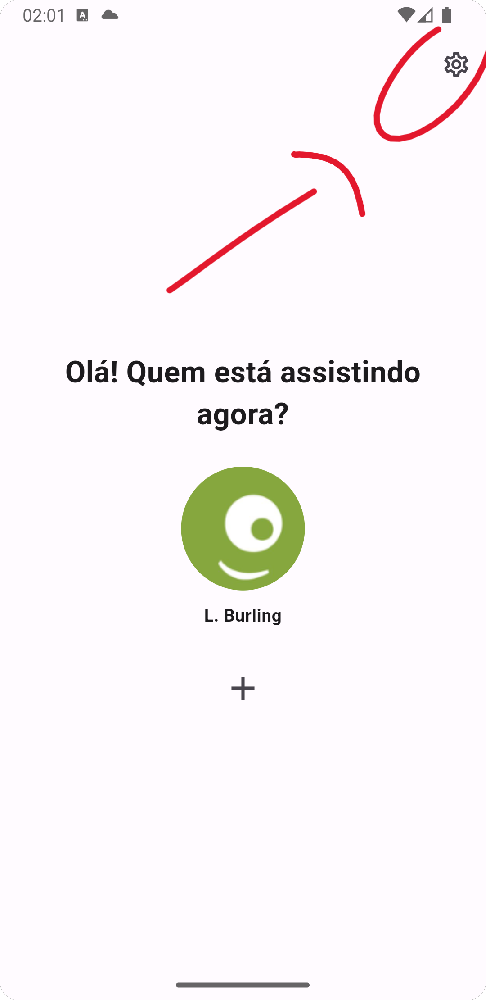
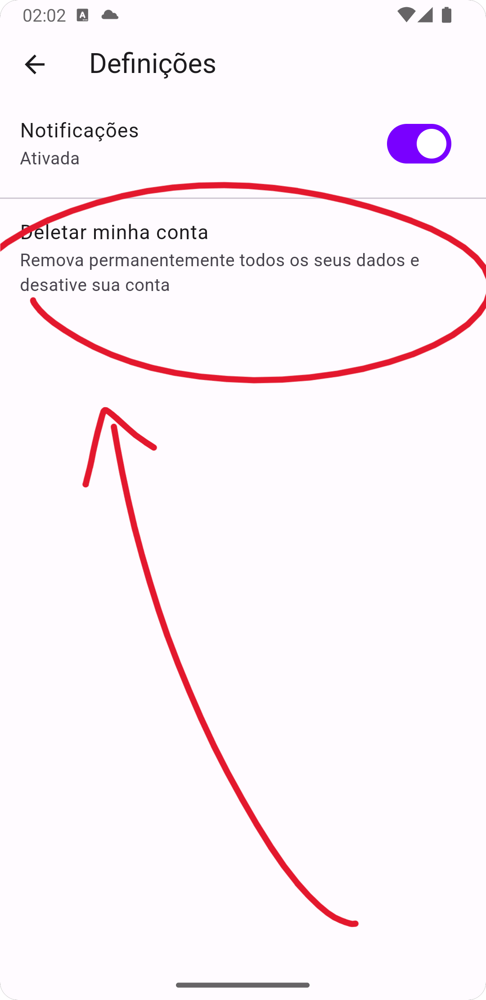
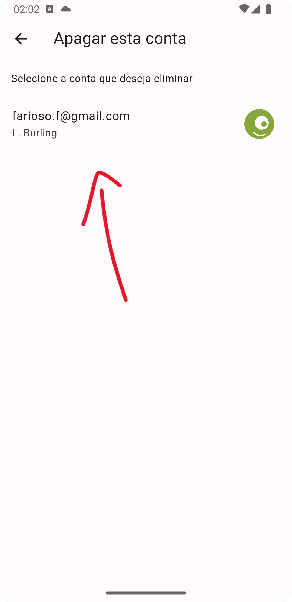
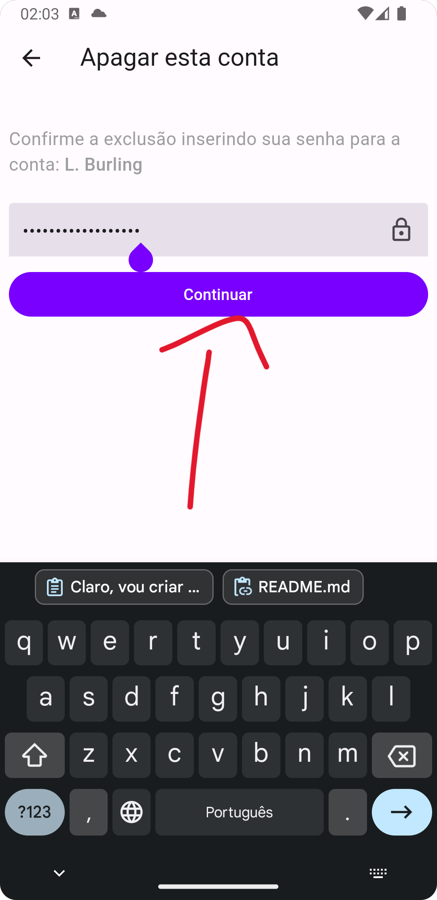
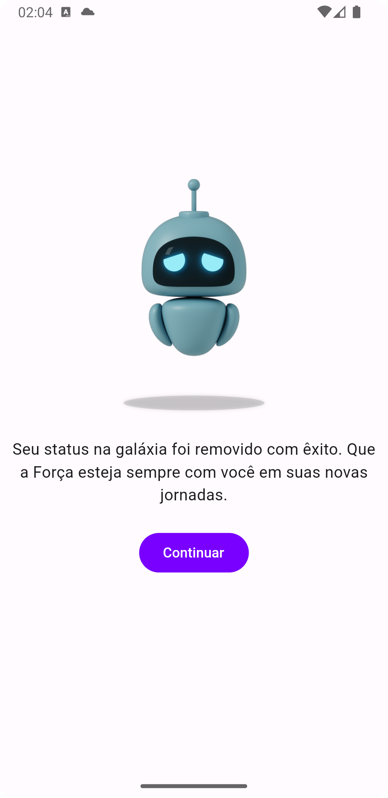

# Eliminação de Conta na Stream

Se deseja eliminar a sua conta na Stream e remover todos os dados associados, siga as instruções abaixo:

## Como eliminar a sua conta:

1. Abra a aplicação Stream.
2. Navegue até `Perfis`.
3. Selecione `Configurações`.
   

      
   

5. Escolha a opção `Deletar minha conta`.
   

      
   

   
7. Selecione a conta que deseja eliminar.
   

      
   

9. Digite a sua palavra-passe para confirmação e clique em `Continuar`.
   

      
   

Após concluir estes passos, a sua conta será removida de forma permanente.
   

      
   

## Dados eliminados:

Ao solicitar a eliminação da sua conta, os seguintes dados serão permanentemente removidos:

- Informações de perfil
- Histórico de atividades
- Qualquer outro dado pessoal associado à sua conta

**Nota:** Certifique-se de que deseja realmente eliminar a sua conta, pois esta ação é irreversível.
